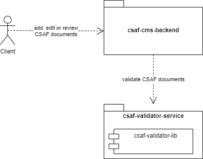
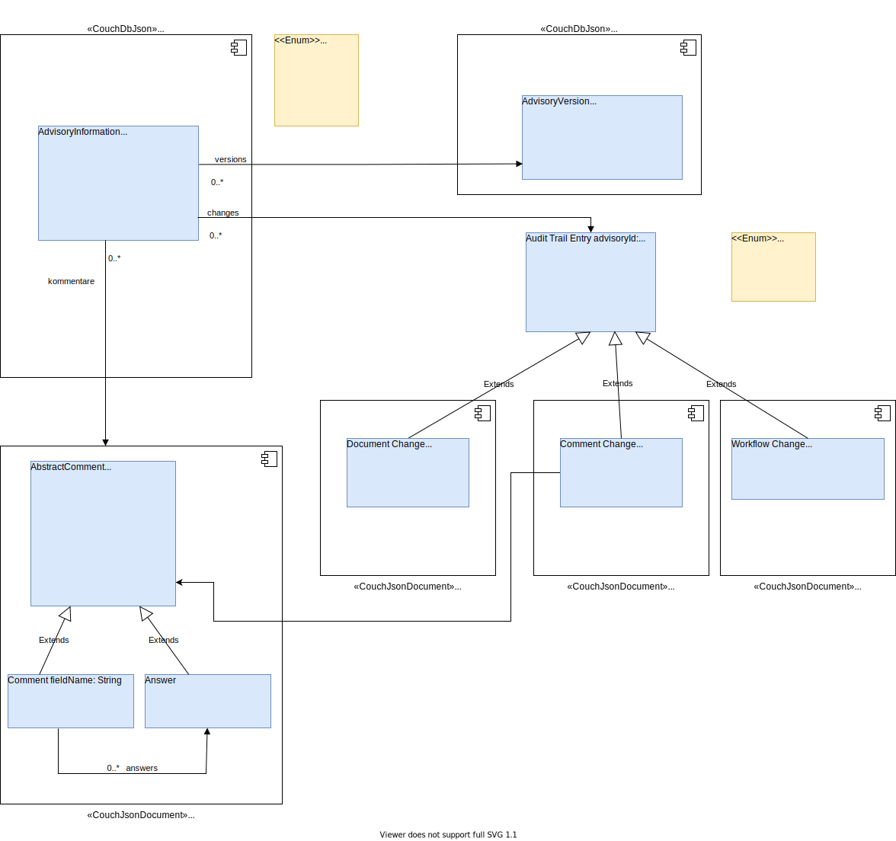

Introduction and Goals
======================

This document describes the architecture decisions for the csaf-cms-backend. This software is used to manage CSAF documents and provide a workflow to handle different document states like 'draft' or 'published'.

Requirements Overview
---------------------

The system must provide all functionality of a CSAF management system as described in [Common Security Advisory Framework Version 2.0](https://docs.oasis-open.org/csaf/csaf/v2.0/csd01/csaf-v2.0-csd01.html#9112-conformance-clause-12-csaf-management-system)

Additional features and requirements:

- Use a document database

- Export documents as html, markdown and pdf

- The structure of the exported document is described by a mustache html template

- It must be possible to write custom functions that generate further data which can then be added to the template.

- The ability to provide a company logo that is visible on the exported document

- Use Keycloak for user/group/role management and to allow LDAP integration

- Provide an API where the user can download prefilled Documents as a starting point for new documents

- Provide workflow functionality for the document states Draft, Review, Approved and Published

- Each change in a document has to be traceable. This will be done by saving the [JSON Patch](https://datatracker.ietf.org/doc/html/rfc6902) between each CSAF document version.

Quality Goals
-------------

- Static code checks

- Code reviews for pull requests

- Provide documentation for:
  
  - Data structures
  
  - API functionality
  
  - How to run/deploy the application
  
  - How to change the export template

- Test coverage of at least 95%

Stakeholders
------------

| Name                                               | Expectations                                               |
| -------------------------------------------------- | ---------------------------------------------------------- |
| tschmidtb51                                        | Provides knowledge and insight into the CSAF specification |
| mfd2007                                            | Provides knowledge and insight into the CSAF specification |
| [eXXcellent solutions GmbH](https://exxcellent.de) | Develops the application                                   |

Architecture Constraints
========================

## Technical Constraints

|     | Constraint                   | Description                                                                                                                                                                                  |
| --- | ---------------------------- | -------------------------------------------------------------------------------------------------------------------------------------------------------------------------------------------- |
| TC1 | Implementation in Java       | The application is using Java 17 and Spring Boot.                                                                                                                                            |
| TC2 | Rest API                     | The API should be language and framework agnostic, however. It should be possible that clients can be implemented using various frameworks and languages.                                    |
| TC3 | OS indepentent development   | It should be possible to compile and run this application on all mayor operating systems (Linux, Mac and Windows)                                                                            |
| TC4 | Deployable to a Linux server | The target platform for deployment is Linux. There must be documentation available on how to deploy and run the application. Docker is not strictly required but should be provided as well. |

## Organizational Constraints

|     | Constraint       | Description                                                                                                                                           |
| --- | ---------------- | ----------------------------------------------------------------------------------------------------------------------------------------------------- |
| OC1 | Time schedule    | The application should be finished until ...                                                                                                          |
| OC2 | IDE independence | No special IDE should be required. Use whatever fits your workflow. The repository should therefore not contain any IDE specific configuration files. |
| OC3 | Testing          | Provide tests to ensure functional correctness. At least 95% test coverage is required.                                                               |
| OC4 | Licensing        | The software must be available under the [MIT License](https://opensource.org/licenses/MIT).                                                          |

## Conventions

|     | Convention                 | Description                                                                              |
| --- | -------------------------- | ---------------------------------------------------------------------------------------- |
| C1  | Architecture documentation | Provide architecture documentation by using the [arc42](https://arc42.org/) method.      |
| C2  | Coding conventions         | This project is using .... This is enforced through....                                  |
| C3  | Language                   | The language used throughout the project is English. (code comments, documentation, ...) |

System Scope and Context
========================

Business Context
----------------



[csaf-validator-service GIT repository](https://github.com/secvisogram/csaf-validator-service)

[csaf-validator-lib GIT repository](https://github.com/secvisogram/csaf-validator-lib)

Technical Context
-----------------

Datamodel
=========

At the current state a CSAF document will be saved as one object in the database. This object will also contain the owner as well as the workflow status. Other relevant information like Comments or the audit trail will be stored separately.



### AdvisoryInformation

Holds a version of a CSAF advisory

| Field        | Description                                        |
| ------------ |----------------------------------------------------|
| advisoryId   | Unique Id of the advisory                          |
| docVersion   | The current Version String of the advisory         |
| worklowState | The workflow state of the advisory                 |
| owner        | The current owner of the advisory                  |
| csafDocument | The CSAF-Document as Json with additional comments |

### AdvisoryInformation

Holds the version history of a CSAF advisory

| Field        | Description                        |
| ------------ | ---------------------------------- |
| docVersion   | The Version String of the advisory |
| csafDocument | The CSAF-Document as Json          |

### WorkflowState

The workflow state of the advisory.  
Possible values:

- Draft

- Review

- Approved

- Published

The workflow state is not part of the CSAF-Document.  

The CSAF-document holds a state in: `/documents/tracking/status`.  
But this one has the enum values: `draft, final, interim`

### Comment

Hold all comments and answers to a CSAF Advisory.

|             |                                                                                                                                                |
|-------------|------------------------------------------------------------------------------------------------------------------------------------------------|
| Field       | Description                                                                                                                                    |
| commentId   | The unique Id of the comment                                                                                                                   |
| docVersion  | Reference to the version of the CSAF AdvisoryInformation                                                                                       |
| changedBy   | User that created/last changed  the comment                                                                                                    |
| changedAt   | Timestamp when the comment was created / last changed                                                                                          |
| fieldName   | null - when the comment belong to whole csaf object or the concrete field name in the csaf object, when the comments belong o a specific field |
| commentText | The text of the comment as string with CR/LF                                                                                                   |
| answers     | List of answers to the comment                                                                                                                 |

A comment can reference either a document as a whole, a specific object or value in the document. Since the CSAF standard has no concept for unique identifiers inside the document we need to persist this relation somehow without unnecessarily adding identifiers to each object. Furthermore we need to remove these IDs before sending the document to the validator service.

The ids of the Comments are referenced from the CSAF Document objects.
When the comments belongs to an dedicated field and not the whole object, the fieldName in the objects is used to specify the concrete value.

We archive this by adding a $comment value to the document where the user adds a comment.

**Example:**

```json
{
  "$comment": [22, 34]
  "document": {
    "$comment": [44, 55]
    "category": "generic_csaf",
    "csaf_version": "2.0",
    "publisher": {
      "$comment": [56, 57]
      "category": "coordinator",
      "name": "exccellent",
      "namespace": "https://exccellent.de"
    },
    "title": "TestRSc",
    "tracking": {
      "current_release_date": "2022-01-11T11:00:00.000Z",
      "id": "exxcellent-2021AB123",
      "initial_release_date": "2022-01-12T11:00:00.000Z",
      "revision_history": [
        {
          "$comment": [58, 59]
          "date": "2022-01-12T11:00:00.000Z",
          "number": "0.0.1",
          "summary": "Test rsvSummary"
        },
       {
         "$comment": [60, 61]
         "date": "2022-01-12T11:00:00.000Z",
         "number": "0.0.1",
         "summary": "Test rsvSummary"
       }
      ],
      "status": "draft",
      "version": "0.0.1",
      "generator": {
        "date": "2022-01-11T04:07:27.246Z",
        "engine": {
          "version": "1.10.0",
          "name": "Secvisogram"
        }
      }
    },
    "acknowledgments": [
      {
        "names": [
          "Alice",
          "Bob"
        ],
        "organization": "exxcellent contribute",
        "summary": "Summary 1234",
        "urls": [
          "https://exccellent.de",
          "https://github.com/secvisogram/csaf-cms-backend"
        ]
      }
    ]
  }
}
```

### Audit Trail

In the Audit Trail all changes to a CSAF Advisory, to comments as well as workflow changes are recorded.

There are 3 Types of changes: Document Change, Comment Change and Workflow Change. They all have he same superclass Audit Trail Entry

#### Audit Trail Entry

Superclass of all changes

| Field      | Description                                              |
| ---------- | -------------------------------------------------------- |
| advisoryId | Reference to the id of the CSAF AdvisoryInformation      |
| docVersion | Reference to the version of the CSAF AdvisoryInformation |
| user       | User that has done the change                            |
| createdAt  | Timestamp when the entries has been created              |

#### Document Change

| Field         | Description                                                                                                    |
| ------------- | -------------------------------------------------------------------------------------------------------------- |
| diff          | the changes to the Previous version in JsonPatch Format ([JSON Patch \| jsonpatch.com](http://jsonpatch.com/)) |
| oldDocVersion | Reference to the old version of the CSAF AdvisoryInformation                                                   |
| changeType    | Created or Update                                                                                              |

#### Workflow Change

Logs the change of the workflow state of the CSAF Advisory

| Field    | Description                                 |
| -------- | ------------------------------------------- |
| oldState | The old workflow state of the CSAF Advisory |
| newState | The new workflow state of the CSAF Advisory |

#### Comment change

Logs changes in comments or answers

| Field      | Description                               |
| ---------- | ----------------------------------------- |
| diff       | The changed text in the comment or answer |
| commentId  | Reference to the id of the comment        |
| changeType | Created or Update                         |

# Export Templates

CSAF documents exporters to the formats html, pdf and markdown have to be available. To export a document a [Mustache](https://mustache.github.io/) html template is used. This provides the document structure and can be further converted into pdf or markdown if needed. This also reduces the maintenance since only one template has to be maintained. The template itself is stored as a file on the server and can be modified without a redeploy of the backend application. A image containing a company logo can also be stored together with the export template. It will be rendered on the first page of the document when exporting.

# Document Templates

A user of this system should be able to download prefilled CSAF documents as templates for new CSAF documents. This first implementation will use a folder to store all available templates. All json documents in this folder will be available as a template. An API will list all available templates to the user.

# Workflow

todo

Risks and Technical Debts
=========================

## Document size limit is 8MB

At the current stage each document is stored as a single document in the database. At the moment CouchDB has a limit of 8MB per document. Since the current focus is the development of a user friendly [editor](https://github.com/secvisogram/secvisogram) for CSAF documents this should be enough.

In the future the documents can be split up and thus remove this restriction. This will also require a change to the API.